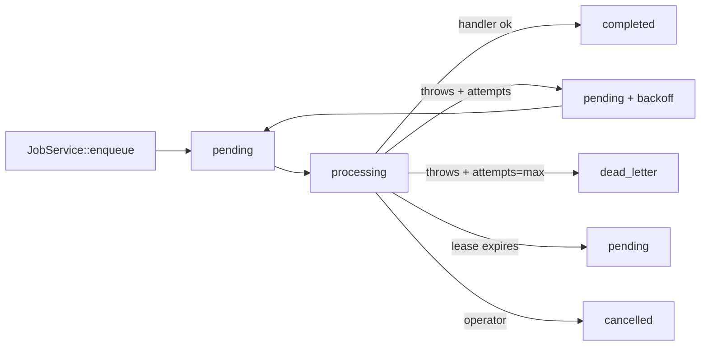

# REACH Async Job Queue — Phase 0

Reach uses a PostgreSQL-backed job queue rather than Redis or file-based
queues so it runs cleanly under cPanel with only Postgres + PHP-FPM +
cron. All queue state lives in the single `reach_jobs` table.

## Schema

Defined in `2026-07-12-100029_CreateReachJobs.php`.

| Column                | Purpose                                                    |
|-----------------------|------------------------------------------------------------|
| `id`                  | Autoincrement PK                                           |
| `job_uuid`            | UUIDv4 default (`gen_random_uuid()`) — external identifier |
| `job_type`            | Slug that maps to a handler (`reach.marketing_bot_dispatch`, `reach.engage_push_retry`, `reach.health_check`) |
| `queue`               | Named queue (`default`, `bots`, ...) so operators can scale by kind |
| `status`              | `pending` \| `processing` \| `completed` \| `failed` \| `dead_letter` \| `cancelled` |
| `priority`            | Higher wins; equal priority breaks by `id` ASC (FIFO)     |
| `payload_json`        | JSONB — redacted via SecretRedactor at enqueue time       |
| `result_json`         | JSONB — redacted return value from the handler            |
| `error_message`       | Last failure message (4kB max)                            |
| `attempts`            | Incremented on each reservation                            |
| `max_attempts`        | Retry ceiling (default 5)                                 |
| `available_at`        | Earliest time the row can be reserved                     |
| `scheduled_at`        | Original schedule anchor (for delayed jobs)               |
| `reserved_at`         | Set when a worker atomically claims the row               |
| `started_at`          | Handler execution start                                    |
| `completed_at`        | Terminal-state timestamp                                   |
| `lease_expires_at`    | Set by `reserve()`; expired leases are recovered          |
| `worker_id`           | Sticky slug (`host.pid`) that owns the lease              |
| `progress` + `progress_message` | Optional progress reporting                     |
| `idempotency_key`     | Optional — unique partial index prevents duplicates       |
| `request_id`          | HTTP correlation id from enqueue site                     |
| `correlation_id`      | Optional business trace id                                 |
| `enqueued_by_user_id` | Reach user who enqueued the job                            |
| `enqueued_actor_type` | `human` \| `system` \| `bot` \| `service`                  |

Indexes:
- `(queue, status, available_at)` — hot path for reservation.
- `(status, lease_expires_at)` — recovery scans.
- `(job_type)` and `(request_id)` — analytics / correlation lookups.
- Unique partial: `idempotency_key WHERE idempotency_key IS NOT NULL`.

CHECK constraints enforce the `status` and `enqueued_actor_type` enums at
the DB layer.

## Status lifecycle



Backoff is `min(2^(attempts-1) * 15s, 3600s)` — capped at 1 hour.

## Reservation contract

```
BEGIN;
  SELECT * FROM reach_jobs
  WHERE queue = $1 AND status = 'pending' AND available_at <= NOW()
  ORDER BY priority DESC, id ASC
  FOR UPDATE SKIP LOCKED
  LIMIT 1;
  UPDATE reach_jobs SET status='processing', reserved_at=..., started_at=...,
                        lease_expires_at=..., worker_id=$2, attempts=attempts+1
  WHERE id = $reserved_id;
COMMIT;
```

`SKIP LOCKED` ensures many workers can safely poll the same queue.

## Handler registry

`App\Libraries\JobHandlerRegistry` maps a `job_type` string to a handler
class in `app/Jobs/`. Every handler implements
`App\Libraries\JobHandlerInterface::handle(array $payload, JobContext $ctx): array`.

Phase 0 handlers:

| Type slug                        | Handler class                                | Purpose                                    |
|----------------------------------|----------------------------------------------|--------------------------------------------|
| `reach.health_check`             | `App\Jobs\HealthCheckJob`                    | Smoke test the worker pipeline             |
| `reach.marketing_bot_dispatch`   | `App\Jobs\MarketingBotDispatchJob`           | Wraps `MarketingBotService::execute()`     |
| `reach.engage_push_retry`        | `App\Jobs\EngagePushRetryJob`                | Retry Engage lead pushes asynchronously    |

## Adding a new job type

1. Create `app/Jobs/YourJob.php` implementing `JobHandlerInterface`.
2. Register it in `JobHandlerRegistry::__construct`.
3. Enqueue from a controller/service:

   ```php
   Services::jobService()->enqueue('your.job_slug', ['foo' => 'bar'], [
       'queue'               => 'default',
       'idempotency_key'     => 'your-thing-42',
       'enqueued_by_user_id' => $userId,
       'enqueued_actor_type' => 'human',
       'request_id'          => $request->reachRequestId ?? null,
   ]);
   ```

4. Bump `max_attempts`, priority, or `scheduled_at` in `$opts` if needed.

## Bot dispatch async contract

`POST v1/bot/dispatch` returns **HTTP 202** immediately with the job
reference:

```json
{
  "ok": true,
  "data": {
    "queue_id": 1234,
    "job_id":   5678,
    "status":   "queued",
    "mode":     "confirm"
  }
}
```

The `BotQueuePage` shows a success alert and directs the user to the Job
Monitor at `/admin/jobs`.

## Job monitor API

All endpoints require permissions; see `app/Config/Routes.php`.

| Method | Path                    | Permission     |
|--------|-------------------------|----------------|
| GET    | v1/jobs                 | `job.view`     |
| GET    | v1/jobs/{id}            | `job.view`     |
| POST   | v1/jobs/{id}/retry      | `job.retry`    |
| POST   | v1/jobs/{id}/cancel     | `job.cancel`   |

Payload redaction: `payload_json` and `result_json` are returned as a
summary hash + top-level key list. A `super_admin` can request the raw
payload with `?include=payload` — audited as `job.payload_viewed`.

## Worker & scheduler CLI

- `php spark reach:work [--queue=default] [--once] [--limit=10] [--worker-id=w1] [--sleep=2] [--lease=300]`
- `php spark reach:schedule` — recovers expired leases, prunes old jobs.

The worker restores `$request->reachRequestId` from `reach_jobs.request_id`
so downstream integration calls carry the original `X-Request-Id`.

## Failure modes and operator playbook

- **Dead-lettered job:** inspect via `GET v1/jobs?status=dead_letter`, fix
  the root cause, and `POST v1/jobs/{id}/retry` to re-enqueue.
- **Stuck lease:** `reach:schedule` recovers any lease whose
  `lease_expires_at` is in the past. Increase `--lease` if handlers commonly
  exceed the default 5-minute limit.
- **Runaway retries:** `POST v1/jobs/{id}/cancel` — audited as
  `job.cancelled` with the operator reason.
- **Idempotency collision:** the enqueue call returns the pre-existing job
  id transparently; no error surfaced to the caller.
