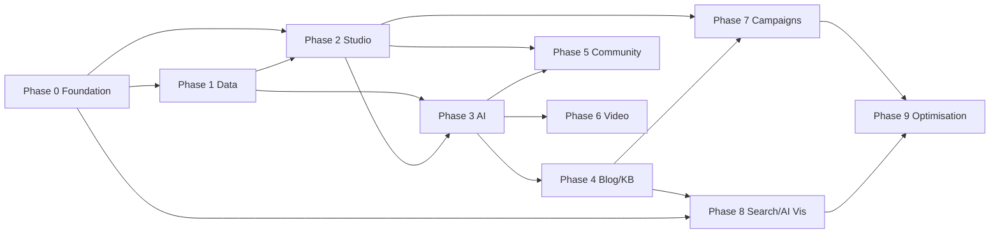

# AICOUNTLY Reach — Proposed Phase Plan

**Audit date:** 2026-07-12  
**Repository:** reach-aicountly  
**Branch:** main | **Commit:** 1766ec2  
**Basis:** Verified findings from inspection report and gap matrix only. No time estimates.

---

## Phase 0 — Remediation and Architecture Stabilisation

### Objective

Stabilise the existing portal foundation: fix build/lint issues, introduce role-based access, async job infrastructure, extended audit logging, and security hardening before expanding automation scope.

### Existing Reusable Components

- `reach_roles`, `reach_users`, `reach_audit_logs` tables
- `SuperAdminFilter`, `JwtFilter`, `AuditLogger`, `ConsoleAuditClient`
- `MarketingBotService` confirm/auto policy framework
- Frontend `ProtectedRoute`, service layer

### Missing Capabilities

- Multi-role RBAC (only `super_admin` exists)
- Background job queue and workers
- Rate limiting
- Automated tests (frontend and backend)
- HTML content sanitisation
- Segregation of duties enforcement

### Recommended Tasks

1. Fix ESLint error in `web/vite.config.js` (`process` not defined)
2. Add Vitest (frontend) and PHPUnit test scaffolding with smoke tests for auth, blog CRUD, approval decide
3. Seed additional roles: Reach Admin, Marketing Manager, Content Planner, Publisher, Compliance Reviewer, Viewer
4. Implement permission checks per role on approve/publish/dispatch endpoints
5. Introduce job queue table and CI4 spark command for worker processing
6. Move `MarketingBotService::dispatch` to async queue execution
7. Add rate-limiting middleware on public and authenticated endpoints
8. Extend audit logging to capture bot decisions, publishing attempts, and validation results
9. Remove or wire orphaned `LoginPage.jsx`
10. Expose `EngagePushController::attempts()` route or remove dead method

### Dependencies

None (first phase).

### Database Impact

- New `reach_jobs` table (or equivalent queue table)
- Extend `reach_roles` seed data
- Optional `reach_role_permissions` mapping

### API Impact

- Permission middleware replacing blanket `super-admin` filter for non-admin roles
- New `GET v1/jobs` admin endpoint (optional)

### Frontend Impact

- Role-aware navigation and action buttons
- Remove dead login page or document as dev-only

### Security Impact

- Rate limiting reduces abuse
- Role segregation reduces unauthorised publish risk
- Test coverage reduces regression risk

### Testing Requirements

- Auth smoke tests (Console SSO mock, JWT validation)
- Blog CRUD integration test
- Approval decide test
- Role permission boundary tests
- Frontend build + lint pass in CI

### Acceptance Criteria

- [ ] `npm run build` and `npm run lint` pass without errors
- [ ] At least 5 backend integration tests pass
- [ ] At least 3 frontend component tests pass
- [ ] 6+ roles seeded with distinct permissions
- [ ] Same user cannot both create and publish without role override
- [ ] Bot dispatch runs via queue worker, not synchronous HTTP
- [ ] Rate limiting active on public lead capture endpoint

### Exit Audit Checklist

- [ ] Re-run build/lint/test suite — all pass
- [ ] Verify role matrix documented
- [ ] Verify no dead routes/components
- [ ] Confirm audit logs capture queue job execution

---

## Phase 1 — Core Marketing Data Foundation

### Objective

Establish authoritative product knowledge, personas, industries, search intents, content types, channels, sources, citations, and brand rules that ground all future content generation.

### Existing Reusable Components

- `SaasProductTaxonomy.php` (12 hardcoded products)
- `reach_settings` key-value store
- `reach_keyword_ideas`, `reach_seo_plans`

### Missing Capabilities

- Product→Module→Feature→Evidence graph
- Persona, industry, search-intent tables
- Content source registry
- Citation store
- Brand voice rules

### Recommended Tasks

1. Design and migrate product knowledge tables (`reach_products`, `reach_modules`, `reach_features`, `reach_personas`, `reach_industries`, `reach_evidence`)
2. Import initial product catalog from `SaasProductTaxonomy` + manual curation
3. Create search-intent library with product/persona/funnel mapping
4. Create content-source registry with reliability scoring
5. Create citation table with authority, jurisdiction, effective-date fields
6. Define brand voice rules in `reach_settings` or dedicated table
7. Build admin UI for product knowledge management
8. API endpoints for product/feature/evidence retrieval (for future RAG)

### Dependencies

Phase 0 (roles, tests).

### Database Impact

- 8–10 new tables for product graph, intents, sources, citations

### API Impact

- `GET/POST/PUT v1/products`, `v1/features`, `v1/personas`, `v1/sources`, `v1/citations`

### Frontend Impact

- New admin pages: Product Knowledge, Sources, Brand Rules

### Security Impact

- Evidence URLs validated before storage (SSRF prevention)
- PII exclusion rules for source ingestion

### Testing Requirements

- Product CRUD tests
- Evidence URL validation tests
- Taxonomy migration verification (all 12 products present)

### Acceptance Criteria

- [ ] All active AICOUNTLY products represented with at least name, slug, description
- [ ] Each product has ≥1 module and ≥1 feature documented
- [ ] Search-intent library has ≥20 intents mapped to products
- [ ] Brand voice rules documented and editable
- [ ] API returns product graph for a given product slug

### Exit Audit Checklist

- [ ] Product graph queryable via API
- [ ] No hardcoded product claims in bot stubs reference graph data
- [ ] Evidence URLs stored with authority metadata

---

## Phase 2 — Content Studio and Editorial Workflow

### Objective

Build a unified content studio with briefs, editors, versions, comments, assignments, approval statuses, and a daily approval centre.

### Existing Reusable Components

- `reach_blog_posts`, `reach_blog_versions` (versioning pattern)
- `reach_approvals`, `ApprovalController`, `ApprovalsPage`
- `reach_creative_briefs`, `reach_content_calendar_items`
- `BlogEditorPage`, `ContentCalendarGrid`, `DataTable`, `ApprovalBadge`

### Missing Capabilities

- Unified content master table (cross-type)
- Rich-text editor
- Comments and assignments
- Daily approval queue with preview
- Multi-stage approval
- Notifications

### Recommended Tasks

1. Create `reach_content_items` master table with `content_type`, `status`, `approval_stage`
2. Migrate blog posts to reference content master (or alias)
3. Add rich-text editor (e.g. TipTap) to blog and brief editors
4. Build daily approval centre page with: today's pending, overdue, priority sort, content preview
5. Implement approval actions: approve, reject, return, request expert review, schedule
6. Add version comparison UI for blog/content
7. Add comments table and UI per content item
8. Implement approval notifications (email digest stub)
9. Connect content calendar to approval statuses

### Dependencies

Phase 0 (roles), Phase 1 (product mapping on content).

### Database Impact

- `reach_content_items`, `reach_content_comments`, `reach_content_assignments`
- Extend `reach_approvals` with `stage`, `priority`, `risk_scores`

### API Impact

- `GET v1/approval-queue/today`, `GET v1/content-items`, comment/assignment endpoints
- Extend `POST v1/approvals/:id/decide` with additional actions

### Frontend Impact

- New Daily Approval Centre page (replace or augment `ApprovalsPage`)
- Rich-text editor component
- Version diff viewer

### Security Impact

- Role-based approval stage enforcement
- Content preview sanitised before render

### Testing Requirements

- Approval queue filtering tests
- Multi-stage approval flow test
- Role boundary: Content Planner cannot publish

### Acceptance Criteria

- [ ] Admin can open Reach and see today's pending approvals with content preview
- [ ] Approve/reject/return actions work with audit trail
- [ ] Blog content editable with rich-text editor
- [ ] Version comparison available for blog posts
- [ ] Calendar shows approval status per item

### Exit Audit Checklist

- [ ] Daily workflow completable in ≤7 clicks (open → preview → decide)
- [ ] Approval history queryable per content item
- [ ] No content type missing from approval queue

---

## Phase 3 — AI Content Generation and Validation

### Objective

Integrate real LLM providers with prompt management, generation jobs, and validation (fact, citation, product-claim, duplicate detection) with cost controls.

### Existing Reusable Components

- `MarketingBotService` (12 actions, confirm/auto policy, artifact persistence)
- `reach_marketing_bot_queue`, `reach_marketing_bot_reports`
- Job queue from Phase 0
- Product knowledge graph from Phase 1

### Missing Capabilities

- Real OpenAI/Anthropic API calls
- Provider abstraction
- Prompt templates and versioning
- Fact/citation/claim validation
- Duplicate detection
- Token/cost accounting

### Recommended Tasks

1. Create `AiProviderService` abstraction (OpenAI, Anthropic; extensible)
2. Create `reach_prompts`, `reach_prompt_versions` tables
3. Replace stub content in `MarketingBotService::execute` with real LLM calls
4. Inject product knowledge context into prompts (RAG from Phase 1 tables)
5. Create `ValidationService` with fact, citation, product-claim, duplicate checks
6. Store validation results on content items before approval queue
7. Add `reach_ai_generations` table for token/cost tracking
8. Implement cost controls (daily budget cap per provider)
9. Add moderation pass on generated content
10. Structured output validation (JSON schema for briefs, metadata)

### Dependencies

Phase 0 (job queue), Phase 1 (product graph), Phase 2 (content master, approval queue).

### Database Impact

- `reach_prompts`, `reach_prompt_versions`, `reach_ai_generations`, `reach_validation_results`

### API Impact

- `GET/POST v1/prompts`, `GET v1/ai/generations`, validation results on content endpoints
- Bot dispatch uses async queue with LLM calls

### Frontend Impact

- Prompt management admin page
- Validation results display in approval queue (risk scores)
- AI provider/cost dashboard

### Security Impact

- PII scrubbing before LLM calls
- Prompt injection mitigation
- Cost cap prevents runaway spend
- No customer/confidential data in prompts without explicit policy

### Testing Requirements

- LLM integration tests (mocked provider)
- Validation rule tests (known bad claims rejected)
- Cost cap enforcement test
- Prompt version rollback test

### Acceptance Criteria

- [ ] Bot `generate_blog_draft` produces real LLM output grounded in product graph
- [ ] Validation flags unsupported product claims before approval
- [ ] Duplicate detection warns on similar existing content
- [ ] Token usage and cost tracked per generation
- [ ] Daily cost cap enforced

### Exit Audit Checklist

- [ ] No stub content returned when LLM keys configured
- [ ] Validation results visible in approval queue
- [ ] All 12 bot actions use real LLM or documented exceptions

---

## Phase 4 — Blog and Knowledge-Base Automation

### Objective

Complete blog workflow automation and introduce knowledge-base generation with SEO, structured data, internal links, and publishing connectors.

### Existing Reusable Components

- `BlogController` (9-state workflow, versioning, approve/publish)
- `AicountlySitePublisher` (HTTP publisher skeleton)
- `reach_seo_plans`, `reach_keyword_ideas`
- SEO fields on `reach_blog_posts`

### Missing Capabilities

- Knowledge-base module (tables, routes, UI)
- Real AICOUNTLY.com publishing API
- Structured data (JSON-LD) generation
- Internal link recommendations
- Sitemap generation

### Recommended Tasks

1. Create knowledge-base tables (`reach_kb_articles`, `reach_kb_categories`)
2. Build KB CRUD API and frontend pages
3. Integrate real AICOUNTLY.com blog write API (or shared PostgreSQL publish path via Flow)
4. Implement structured data generator (Article, FAQPage schemas)
5. Build internal link recommendation engine from content index
6. Add automated SEO scoring to blog/KB before approval
7. Implement publishing scheduler (approved → scheduled → publish at time)
8. Add sitemap.xml generation for published content
9. Bot actions: `generate_kb_article`, extend `generate_blog_draft`

### Dependencies

Phase 1 (product mapping), Phase 2 (content studio), Phase 3 (AI generation, validation).

### Database Impact

- `reach_kb_articles`, `reach_kb_categories`
- `reach_structured_data` (optional, or JSONB on content items)

### API Impact

- `GET/POST/PUT/DELETE v1/kb/articles`, `v1/kb/categories`
- Enhanced `POST v1/blog/posts/:id/publish` with real connector
- `GET v1/sitemap.xml` (or publishing-side)

### Frontend Impact

- Knowledge Base list/editor pages
- SEO score display in editor
- Structured data preview

### Security Impact

- Published content sanitised
- Publishing credentials remain server-side

### Testing Requirements

- Blog end-to-end: draft → validate → approve → publish
- KB article CRUD tests
- Structured data validation (Google Rich Results schema check)
- Sitemap contains only approved published URLs

### Acceptance Criteria

- [ ] Blog published to AICOUNTLY.com (or documented staging target) with real API
- [ ] KB articles creatable, approvable, and publishable
- [ ] JSON-LD generated for blog and KB articles
- [ ] Internal link suggestions appear in editor
- [ ] Sitemap updates on publish

### Exit Audit Checklist

- [ ] Publish flow tested end-to-end on staging
- [ ] No `pending_publishing` stuck states without error message
- [ ] KB articles mapped to product/module

---

## Phase 5 — Community and Q&A Automation

### Objective

Integrate with AICOUNTLY community platform for transparent official Q&A publishing with moderation and safeguards against fabricated users.

### Existing Reusable Components

- Approval workflow from Phase 2
- AI generation and validation from Phase 3
- Product knowledge graph from Phase 1

### Missing Capabilities

- Entire community module
- Community API connector
- Official account publishing
- Duplicate-question detection
- QAPage structured data

### Recommended Tasks

1. Design community integration API (aicountly.com/community)
2. Create `reach_community_questions`, `reach_community_answers` tables
3. Build community admin UI (questions, answers, moderation queue)
4. Implement transparency rules: official FAQs, suggested questions, admin-created threads only
5. Bot actions: `generate_community_question`, `generate_community_answer` with validation
6. Duplicate-question detection against existing community + KB
7. QAPage JSON-LD generation
8. Publishing connector to community platform
9. Moderation workflow (abuse reporting, spam controls)

### Dependencies

Phase 2 (approval), Phase 3 (AI, validation), community platform API availability.

### Database Impact

- `reach_community_questions`, `reach_community_answers`, `reach_community_categories`

### API Impact

- `GET/POST/PUT v1/community/questions`, `v1/community/answers`
- Publishing connector endpoints

### Frontend Impact

- Community management pages
- Moderation queue in approval centre

### Security Impact

- **Critical:** Enforce no fabricated user personas
- Official account attribution required
- Statutory advice requires compliance reviewer approval

### Testing Requirements

- Transparency rule tests (reject fake user attribution)
- Duplicate-question detection tests
- Publishing integration tests (mocked community API)

### Acceptance Criteria

- [ ] Questions publishable only as official/suggested/admin-created
- [ ] Answers publishable only from identifiable official accounts
- [ ] Duplicate questions detected and blocked
- [ ] QAPage schema valid for published Q&A
- [ ] Moderation queue functional

### Exit Audit Checklist

- [ ] No fabricated customer personas in published content
- [ ] Community publishing tested on staging
- [ ] Compliance reviewer role required for statutory content

---

## Phase 6 — Video Content Automation

### Objective

Support video topic ideation, script generation, storyboards, captions, and publishing integration.

### Existing Reusable Components

- `reach_creative_briefs` (video deliverables mentioned)
- Bot action framework
- AI generation from Phase 3
- Worker Playwright client (screenshot/review)

### Missing Capabilities

- Entire video module
- Script/storyboard generation
- Rendering integration
- YouTube publishing

### Recommended Tasks

1. Create `reach_video_projects` table (topic, script, storyboard, status)
2. Bot actions: `generate_video_topic`, `generate_video_script`, `generate_captions`
3. Build video project admin UI
4. Integrate caption/subtitle generation
5. YouTube publishing connector (or manual queue with metadata export)
6. Link video projects to related blog/KB/community content
7. Approval workflow for video scripts before production

### Dependencies

Phase 2 (approval), Phase 3 (AI), Phase 4 (related content).

### Database Impact

- `reach_video_projects`, optional `reach_video_scenes`

### API Impact

- `GET/POST/PUT v1/video/projects`
- YouTube publishing endpoint

### Frontend Impact

- Video project list/editor pages
- Script preview in approval queue

### Security Impact

- Video scripts validated for product claims
- No auto-publish to YouTube without approval

### Testing Requirements

- Video project CRUD tests
- Script generation tests (mocked LLM)
- YouTube metadata validation

### Acceptance Criteria

- [ ] Video topics generatable from content gaps
- [ ] Scripts approvable before production
- [ ] Captions generatable from script
- [ ] YouTube publishing functional (or manual queue with full metadata)

### Exit Audit Checklist

- [ ] Video workflow integrated into daily approval centre
- [ ] Related content links (blog, KB) functional

---

## Phase 7 — Campaign and Distribution Automation

### Objective

Automate email, WhatsApp, SMS, and social campaign distribution with segmentation, scheduling, and campaign analytics.

### Existing Reusable Components

- `reach_email_campaigns`, `reach_whatsapp_campaigns`, `reach_social_posts`
- `reach_campaigns` with UTM fields
- Social approve/manual queue workflow
- Publishing scheduler from Phase 4

### Missing Capabilities

- Real email provider integration
- WhatsApp Business API integration
- SMS/DLT module
- Social auto-posting SDKs
- Audience segmentation

### Recommended Tasks

1. Integrate email provider (e.g. SendGrid, SES) with send + tracking
2. Integrate WhatsApp Business API with template messaging
3. Create SMS campaign module with DLT compliance fields
4. Integrate social platform SDKs (LinkedIn, X, Meta) behind approval gate
5. Create `reach_audiences`, `reach_segments` tables
6. Build campaign scheduler (approved → send at time)
7. UTM generator service for all outbound links
8. Campaign analytics dashboard (opens, clicks, delivery)
9. Bot action: `generate_email_campaign`, `generate_social_campaign`

### Dependencies

Phase 0 (job queue), Phase 2 (approval), Phase 4 (scheduler).

### Database Impact

- `reach_audiences`, `reach_segments`, `reach_sms_campaigns`
- Campaign analytics fields

### API Impact

- Enhanced email/WhatsApp/SMS send endpoints (replace mark-sent)
- Social auto-post endpoints
- `GET v1/campaigns/:id/analytics`

### Frontend Impact

- Audience/segment management pages
- Campaign analytics dashboard
- Channel preview in approval queue

### Security Impact

- Campaign sends require approval (no auto-send)
- Subscriber PII protected
- DLT compliance for SMS

### Testing Requirements

- Email send integration test (sandbox provider)
- WhatsApp template send test
- Social post test (sandbox)
- UTM generation consistency test

### Acceptance Criteria

- [ ] Email campaigns sendable after approval
- [ ] WhatsApp campaigns sendable with approved templates
- [ ] Social posts auto-posted after approval (when credentials configured)
- [ ] SMS module created with DLT fields
- [ ] Campaign analytics show delivery/opens/clicks

### Exit Audit Checklist

- [ ] No campaign sendable without approval record
- [ ] UTM parameters consistent across channels
- [ ] mark-sent manual stubs replaced with real sends

---

## Phase 8 — Search and AI Visibility

### Objective

Integrate Search Console, Bing Webmaster, IndexNow, AI referral analytics, prompt-test library, and competitor monitoring.

### Existing Reusable Components

- `TrafficAnalyticsService`, `Ga4AnalyticsClient`
- `reach_analytics_snapshots`, `reach_analytics_cache`
- `SaasProductTaxonomy` (product categories for monitoring)

### Missing Capabilities

- GSC/Bing integration
- IndexNow
- AI visibility prompt testing
- Competitor monitoring
- Per-content search performance

### Recommended Tasks

1. Integrate Google Search Console API (impressions, clicks, position)
2. Integrate Bing Webmaster Tools API
3. Implement IndexNow notification on publish
4. Create `reach_ai_visibility_tests` table (platform, prompt, result, citations)
5. Build prompt-test library with scheduled execution
6. AI referral traffic tracking in GA4
7. Competitor mention monitoring in AI test results
8. Per-content search performance dashboard
9. Content gap analysis from GSC queries + AI visibility failures

### Dependencies

Phase 4 (publishing URLs), Phase 0 (job queue for scheduled tests).

### Database Impact

- `reach_ai_visibility_tests`, `reach_search_performance`, `reach_competitor_mentions`

### API Impact

- `GET v1/search-performance`, `GET/POST v1/ai-visibility/tests`
- IndexNow trigger on publish hook

### Frontend Impact

- Search performance dashboard
- AI visibility monitoring page
- Competitor comparison view

### Security Impact

- Search API credentials server-side
- AI test results do not expose internal data

### Testing Requirements

- GSC API integration test (mocked)
- IndexNow notification test
- AI visibility test storage and retrieval

### Acceptance Criteria

- [ ] GSC data importable for marketing site
- [ ] IndexNow fires on content publish
- [ ] Prompt-test library with ≥10 baseline prompts
- [ ] AI visibility results show mention/recommendation rates
- [ ] Content gaps identified from search + AI data

### Exit Audit Checklist

- [ ] Search performance dashboard populated
- [ ] AI visibility tests schedulable
- [ ] Competitor mentions tracked

---

## Phase 9 — Optimisation and Autonomous Recommendations

### Objective

Performance-based topic selection, content refresh automation, repurposing, lead attribution depth, and controlled automation policies.

### Existing Reusable Components

- Analytics from Phase 8
- Content performance data
- Bot recommendation actions (`recommend_campaign_improvements`)
- Lead attribution from Phase 7

### Missing Capabilities

- Performance-based topic selection
- Content refresh queue
- Repurposing workflows
- Recommendation-readiness scoring
- Controlled automation policies

### Recommended Tasks

1. Build content performance scoring model (views, search position, AI mentions)
2. Create `reach_content_refresh_tasks` table with priority
3. Bot action: `recommend_content_refresh` based on performance thresholds
4. Repurposing workflows (blog → social → email → video script)
5. Lead attribution pipeline (content → lead → Engage → opportunity)
6. Recommendation-readiness scoring per product/category
7. Automation policy engine (what can auto-run vs requires approval)
8. Performance-based topic selection for bot dispatch
9. Dashboard: content ROI, attribution, refresh recommendations

### Dependencies

All prior phases (especially 3, 4, 7, 8).

### Database Impact

- `reach_content_refresh_tasks`, `reach_automation_policies`, `reach_attribution_events`

### API Impact

- `GET v1/recommendations/topics`, `GET v1/recommendations/refresh`
- `GET/PUT v1/automation/policies`

### Frontend Impact

- Recommendations dashboard
- Automation policy admin page
- Attribution visualisation

### Security Impact

- Automation policies prevent unauthorised auto-publish
- Performance data does not expose customer PII

### Testing Requirements

- Refresh recommendation trigger tests
- Attribution chain test (content → lead → Engage)
- Automation policy enforcement tests

### Acceptance Criteria

- [ ] Underperforming content flagged for refresh
- [ ] Topic recommendations based on performance + gaps
- [ ] Repurposing generates linked content across channels
- [ ] Lead attribution traceable to source content
- [ ] Automation policies enforce approval boundaries

### Exit Audit Checklist

- [ ] Full target pipeline operational end-to-end
- [ ] Automation policies documented and enforced
- [ ] Content quality metrics trending positive
- [ ] Re-audit against gap matrix — all Critical items addressed

---

## Phase Dependency Graph

---

## Re-audit Trigger

A full re-audit should be conducted after Phase 0 completion and again after Phase 4 (first publishing milestone) to verify evidence-based status upgrades before proceeding to community and campaign automation.
