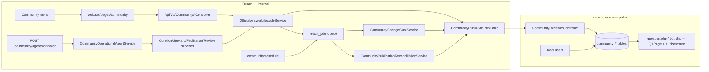

# Architecture As-Built vs. Claimed

## What was claimed vs. what existed at baseline

`docs/architecture/REACH_COMMUNITY_ARCHITECTURE.md` and
`docs/phases/PHASE_5_*` describe the diagram above as already built. Tracing
every arrow against the actual code at baseline (commit `6d9d61d` / Reach,
`6e51502` / public) found:

| Arrow | Claimed | As found at baseline |
|-------|---------|----------------------|
| UI → API → Lifecycle → Jobs | Working | **Sound** — controller↔service↔job wiring for intake/createDraft/requestGeneration/publish/withdraw was correct and is a regression target, not a rewrite target (per the locked plan) |
| Lifecycle → Publisher → Receiver | One live receiver | **Broken (G1, Critical)** — two receiver stacks existed; Reach's real publisher signed requests the live legacy endpoint could never authenticate. Fixed in Phase 1, see `05_PUBLIC_RECEIVER_CUTOVER.md`. |
| AgentAPI → Agents → Collaborators | Five operational roles running | **Did not exist (G17, High)** — schema-only. Built in Phase 3, wired to HTTP in Phase 5 (G20). See `11_AGENT_RUNTIME.md`. |
| Schedule → Jobs | Cron-orchestrated automation | **Did not exist (G15, High)** — every community job required manual/ad hoc enqueue. Built in Phase 4, see `12_AUTOMATION_SCHEDULE_QUEUE.md`. |
| Jobs → Sync → Publisher | Reach learns of public-side moderation changes | **Did not exist (G19, High)** — no client method for the receiver's own `/changes` endpoint. Built in Phase 4. |
| Jobs → Reconcile → Publisher | Drift detection between Reach and public | **Did not exist (G11, High)** — claimed by architecture docs, absent in code. Built in Phase 2, see `10_RECONCILIATION.md`. |
| PublicDB → Pages | QAPage, AI disclosure, bot profile | **Partially broken (G4–G6, High)** — schema made bot/official authorship structurally impossible in places; no bot profile page existed. Fixed in Phase 1, see `07_BOT_VOTE_AI_DISCLOSURE.md`. |

## Decision record

Two architectural forks were explicitly decided (not left to default/no-op)
at the start of this audit and are locked for the remainder of this
document set:

- **1A** — Wire the full `CommunityReceiverController` as the live HTTP path,
  not the legacy `community.php` shim (which is now dead-code-with-a-410,
  kept for historical reference only).
- **2A** — One role-routed dispatcher (`CommunityOperationalAgentService`)
  keyed by `operational_role`, not five duplicate per-role modules.

## Everything else: regression-verified, not rewritten

Per the plan's explicit "already verified — do not re-break" list: the
Reach controller↔service lifecycle, the five registered jobs calling real
methods, analytics cache upsert columns (once the engagement schema itself
was fixed — see `08_ENGAGEMENT_SCHEMA.md`), and `community_*` role seeding
were all re-run against the current test suite at the end of every phase in
this audit and remained green throughout — see `13_TEST_AND_BUILD_EVIDENCE.md`.
